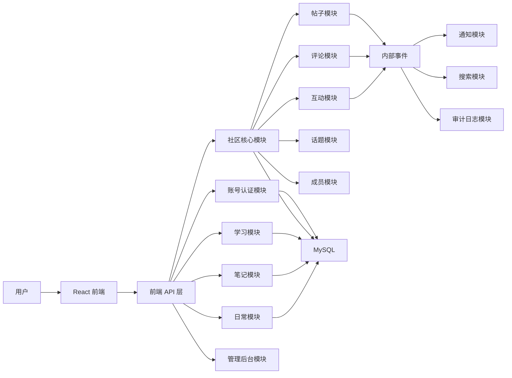

# Violet Circle 模块化社区架构补充规格

本文档补充 `2026-07-10-violet-circle-community-design.md`。

目标不是把 StudyFlow 简单改成一个发帖页面，而是把它升级成一个以后可以持续扩展的个人小圈子社区平台。第一版仍然保持简单可上线，但底层设计要给后续的学习模块、笔记模块、日常模块、消息模块、搜索模块、文件模块留下清晰位置。

## 核心判断

第一阶段推荐使用“模块化单体”，不是一上来就拆微服务。

原因：

- 你现在是一台服务器、一个人开发、一个项目展示，微服务会带来更多部署、网络、日志、权限、数据一致性成本。
- 模块化单体可以先用一个 Spring Boot 后端、一个 React 前端、一个 MySQL 数据库跑起来。
- 只要代码包、数据库表、接口路径、业务边界提前规划好，以后真的需要拆时，可以把通知、文件、搜索、私信这些模块逐步拆出去。

一句话：第一版不要假装大厂微服务，但要按以后能拆的方式写。

## 产品总形态

Violet Circle 以后可以理解成你的“私人社区操作系统”。

它有三个层次：

1. 社区层：朋友之间发动态、评论、点赞、看成员、看话题。
2. 个人工具层：学习、笔记、日常、项目管理，这些保留并升级，不删掉。
3. 平台能力层：账号、权限、通知、搜索、文件、安全、管理后台。

用户看到的是一个统一网站：

```text
登录
  -> Violet Circle 首页
       -> 圈子动态
       -> 学习模块
       -> 笔记模块
       -> 日常模块
       -> 个人主页
       -> 管理后台
```

底层则按模块隔离，避免未来越写越乱。

## 模块化总图



第一版只需要真的实现账号、社区核心、帖子、评论、点赞、话题、成员、管理后台。通知、搜索、文件、私信先作为后续模块设计好入口，不急着做。

## 模块边界

### 1. 账号认证模块

职责：

- 注册。
- 登录。
- JWT 鉴权。
- 密码 BCrypt 哈希。
- 用户状态控制，比如正常、禁用。
- 用户角色控制，比如普通用户、管理员。

不负责：

- 不负责帖子业务。
- 不负责评论业务。
- 不直接处理社区内容审核。

后续可扩展：

- 登录设备管理。
- 登录日志。
- 二次验证。
- 第三方登录。
- 注册限流和验证码。

### 2. 用户资料模块

职责：

- 昵称。
- 头像地址。
- 个人简介。
- 技术标签。
- 个人主页展示信息。

不负责：

- 不负责登录密码。
- 不负责权限判断。
- 不负责好友关系。

后续可扩展：

- 个人主页皮肤。
- GitHub 链接。
- 学习成就。
- 公开作品集。

### 3. 圈子模块

第一版界面只做一个默认圈子，但数据库和代码预留 `circle_id`。

这样设计的好处是：现在用户注册后直接进入默认圈子，不需要邀请码；以后如果你想做“朋友圈”“学习圈”“项目圈”，不用推翻数据库。

职责：

- 表示一个社区空间。
- 管理圈子成员。
- 给帖子、话题、评论提供归属。

第一版行为：

- 系统内只有一个默认圈子。
- 新用户注册后自动成为默认圈子成员。
- 前端暂时不展示“切换圈子”。

后续可扩展：

- 多圈子。
- 私密圈子。
- 圈子管理员。
- 圈子公告。

### 4. 帖子模块

职责：

- 发帖。
- 编辑自己的帖子。
- 删除自己的帖子。
- 查看帖子详情。
- 维护帖子状态。
- 维护帖子统计字段，比如评论数、点赞数、浏览数。

不负责：

- 不直接写评论表。
- 不直接写点赞表。
- 不直接做通知。
- 不直接做全文搜索索引。

后续可扩展：

- Markdown。
- 图片附件。
- 置顶。
- 精华。
- 收藏。
- 转发。
- 帖子可见范围。

### 5. 评论模块

职责：

- 创建评论。
- 删除自己的评论。
- 管理员隐藏评论。
- 查询帖子的评论列表。

第一版只做一级评论。

数据库可以预留 `parent_id`，但第一版全部写 `NULL`。这样以后做楼中楼时，不需要重新设计评论表。

不负责：

- 不决定帖子是否存在，它只校验帖子状态。
- 不直接给用户发通知，只发布内部事件。

后续可扩展：

- 楼中楼回复。
- 评论点赞。
- 评论折叠。
- 敏感词审核。

### 6. 互动模块

职责：

- 点赞。
- 取消点赞。
- 查询当前用户是否点赞。
- 维护互动计数。

推荐表设计为通用互动表，而不是只叫 `community_post_reactions`。

原因：以后帖子、评论、笔记、日常动态都可能被点赞。如果第一版只建帖子点赞表，后面要加评论点赞会重复造表。

第一版只开放帖子点赞，但表结构支持：

- `target_type = POST`
- `target_type = COMMENT`
- `target_type = NOTE`
- `target_type = DAILY`

后续可扩展：

- 表情反应。
- 收藏。
- 感谢。
- 标记有用。

### 7. 话题模块

职责：

- 创建话题。
- 查询话题列表。
- 给帖子绑定话题。
- 统计话题下帖子数量。

第一版话题由管理员维护，普通用户发帖时选择。

后续可扩展：

- 用户申请新话题。
- 热门话题。
- 话题关注。
- 话题说明页。

### 8. 成员模块

职责：

- 成员列表。
- 成员主页。
- 当前用户的社区身份。
- 成员状态，比如正常、禁言、禁用。

第一版不做好友关系。

后续可扩展：

- 关注。
- 好友。
- 黑名单。
- 成员成就。
- 在线状态。

### 9. 管理后台模块

职责：

- 隐藏帖子。
- 恢复帖子。
- 隐藏评论。
- 禁用用户。
- 查看社区基础统计。

原则：

- 管理后台不要直接绕过业务模块改数据库。
- 管理后台应该调用帖子模块、评论模块、成员模块提供的服务方法。
- 这样以后权限和日志更容易统一。

后续可扩展：

- 举报处理。
- 操作日志。
- 内容审核队列。
- 风险用户列表。

### 10. 学习模块

这是原 StudyFlow 的核心价值，不能删。

职责：

- 学习项目。
- 学习任务。
- 学习进度。
- 技术栈整理。
- 作品集沉淀。

和社区的关系：

- 用户可以把学习进度分享到圈子动态。
- 帖子可以关联一个学习项目。
- 个人主页可以展示学习路线。

第一版可以先把它作为“个人工具箱”保留，等社区核心稳定后再做深度联动。

### 11. 笔记模块

职责：

- 写笔记。
- 管理笔记目录。
- 搜索笔记。
- 把笔记转成帖子分享。

和 Notion 的区别：

- Notion 是通用工作空间。
- 我们先做适合你和朋友的小圈子知识沉淀。
- 第一版不追求无限块编辑器，先做稳定的 Markdown 或富文本笔记。

后续可扩展：

- 双链。
- 标签。
- 公开笔记。
- 协作编辑。
- 知识库。

### 12. 日常模块

职责：

- 日常记录。
- 打卡。
- 心情或生活状态。
- 每日总结。

和社区的关系：

- 可以选择把某条日常发布到圈子。
- 可以在个人主页显示近期日常。

第一版不急着做复杂，先作为未来模块预留。

### 13. 通知模块

第一版可以不做完整通知中心，但后端最好预留事件思路。

未来触发通知的事件：

- 有人评论了我的帖子。
- 有人点赞了我的帖子。
- 管理员隐藏了我的内容。
- 有人提到了我。
- 学习任务快到期。

第一阶段实现方式：

- 可以先不落库。
- 可以先只在代码里定义事件类。
- 不引入 Kafka、RabbitMQ 这种重型消息队列。

后续如果规模变大：

- 先用数据库通知表。
- 再用 Redis Stream。
- 再考虑 RabbitMQ 或 Kafka。

### 14. 文件媒体模块

第一版不做图片上传。

后续职责：

- 上传头像。
- 上传帖子图片。
- 上传笔记图片。
- 文件访问权限。
- 图片压缩。
- 图片安全检查。

未来可拆微服务，因为文件上传和主业务关系比较松，而且资源消耗独立。

### 15. 搜索模块

第一版可以先用 MySQL 简单查询。

后续职责：

- 搜索帖子。
- 搜索评论。
- 搜索笔记。
- 搜索学习项目。
- 搜索成员。

未来可拆为独立搜索服务，比如 Meilisearch、Elasticsearch 或 Typesense。

### 16. 私信模块

第一版不做私信。

后续职责：

- 一对一消息。
- 已读状态。
- 消息撤回。
- 端到端加密。

重要说明：

- 社区帖子不适合端到端加密，因为管理员审核、搜索、话题聚合都需要服务端能理解内容。
- 私信适合端到端加密，因为它是用户之间的私密通信。
- 后期如果你说“把加密做好”，最适合优先做的是私信和敏感资料字段，不是把所有帖子都加密到服务端看不懂。

## 后端代码结构建议

现在项目是 Java Spring Boot。建议新增代码时按业务模块分包，而不是全部塞进 controller、service、mapper 这三个大文件夹。

推荐结构：

```text
backend/src/main/java/com/studyflow
  auth
    controller
    service
    dto
  user
    profile
    role
  community
    common
    circle
    post
      controller
      service
      mapper
      model
      dto
    comment
      controller
      service
      mapper
      model
      dto
    reaction
      controller
      service
      mapper
      model
      dto
    topic
      controller
      service
      mapper
      model
      dto
    member
      controller
      service
      mapper
      model
      dto
    moderation
      controller
      service
      dto
    feed
      controller
      service
      dto
  study
  notes
  daily
  notification
  audit
```

这样写有一个好处：你打开 `community/post` 就知道帖子相关代码都在这里，不需要在全项目到处找。

## 后端依赖规则

模块之间不能随便互相调用，否则后面会乱。

建议依赖方向：

```text
auth -> 不依赖社区
user/profile -> 依赖 auth 的用户身份
community/circle -> 依赖 user
community/topic -> 依赖 circle
community/post -> 依赖 circle、topic、user
community/comment -> 依赖 post、user
community/reaction -> 依赖 post/comment/user
community/feed -> 读取 post/comment/reaction 的聚合结果
community/moderation -> 调用 post/comment/member 的服务
notification -> 监听事件，不反向控制业务
audit -> 记录事件，不反向控制业务
```

重点：

- 帖子模块可以发布 `PostCreatedEvent`。
- 评论模块可以发布 `CommentCreatedEvent`。
- 点赞模块可以发布 `ReactionCreatedEvent`。
- 通知、搜索、审计以后监听这些事件。
- 核心业务不要依赖未来模块。

这样未来拆微服务时，事件边界已经存在。

## 数据库设计升级

原设计已经有社区表。为了未来模块化，建议做一点增强。

### 第一阶段建议落地表

```text
circles
circle_members
user_profiles
community_topics
community_posts
community_comments
community_reactions
community_moderation_actions
```

### circles

用途：表示一个圈子空间。

第一版只有一条默认数据。

建议字段：

```text
id
name
slug
description
visibility
status
created_at
updated_at
```

字段说明：

- `visibility` 第一版固定为 `PUBLIC_REGISTERED`，表示注册用户可进入。
- `status` 用于以后关闭某个圈子。

### circle_members

用途：表示用户属于哪个圈子。

第一版注册后自动加入默认圈子。

建议字段：

```text
id
circle_id
user_id
role
status
joined_at
created_at
updated_at
```

字段说明：

- `role` 可以是 `OWNER`、`ADMIN`、`MEMBER`。
- `status` 可以是 `ACTIVE`、`MUTED`、`DISABLED`。
- 后续做禁言时，不必直接禁用整个账号，可以只禁用某个圈子的发言权。

### user_profiles

用途：用户展示资料。

建议字段：

```text
id
user_id
display_name
bio
avatar_url
skills
github_url
website_url
created_at
updated_at
```

字段说明：

- `skills` 第一版可以用字符串保存，后续再拆成标签表。
- `avatar_url` 第一版可以为空，等文件模块做好后再启用。

### community_topics

用途：圈子里的话题。

建议字段：

```text
id
circle_id
name
slug
description
color
sort_order
post_count
status
created_at
updated_at
```

字段说明：

- `circle_id` 为以后多圈子准备。
- `slug` 用于未来做更好看的链接。
- `post_count` 可以冗余，换取列表查询速度。

### community_posts

用途：帖子。

建议字段：

```text
id
circle_id
author_id
topic_id
title
content
content_format
visibility
status
pinned
comment_count
reaction_count
view_count
last_activity_at
created_at
updated_at
deleted_at
```

字段说明：

- `content_format` 第一版可以是 `TEXT` 或 `MARKDOWN`。
- `visibility` 第一版固定为 `CIRCLE`。
- `status` 推荐用 `PUBLISHED`、`HIDDEN`、`DELETED`，比单纯 `deleted=true` 更适合管理后台。
- `last_activity_at` 用于动态流排序，评论后可以更新。
- `pinned` 用于管理员置顶。

### community_comments

用途：评论。

建议字段：

```text
id
circle_id
post_id
author_id
parent_id
content
status
reaction_count
created_at
updated_at
deleted_at
```

字段说明：

- `parent_id` 第一版写 `NULL`。
- 后续做楼中楼时，回复某条评论就写那条评论的 `id`。

### community_reactions

用途：通用互动。

建议字段：

```text
id
circle_id
target_type
target_id
user_id
reaction_type
created_at
```

唯一约束：

```text
circle_id + target_type + target_id + user_id + reaction_type
```

字段说明：

- 第一版 `target_type` 只用 `POST`。
- 后续可以扩展 `COMMENT`、`NOTE`、`DAILY`。
- `reaction_type` 第一版只用 `LIKE`。

### community_moderation_actions

用途：记录管理员操作。

建议字段：

```text
id
circle_id
admin_user_id
target_type
target_id
action_type
reason
created_at
```

字段说明：

- 这张表可以让你在面试时讲清楚：系统不是简单 CRUD，已经考虑了管理和审计。

### 第二阶段再做的表

```text
notifications
media_files
saved_items
reports
search_index_jobs
direct_messages
```

这些不进入第一版，避免范围失控。

## 接口设计升级

接口路径也要模块化。推荐约定：

```text
/api/auth/**
/api/users/**
/api/community/**
/api/study/**
/api/notes/**
/api/daily/**
/api/admin/**
```

### 社区接口

动态流：

```text
GET /api/community/feed
```

帖子：

```text
POST /api/community/posts
GET /api/community/posts/{postId}
PUT /api/community/posts/{postId}
DELETE /api/community/posts/{postId}
```

评论：

```text
GET /api/community/posts/{postId}/comments
POST /api/community/posts/{postId}/comments
DELETE /api/community/comments/{commentId}
```

互动：

```text
POST /api/community/posts/{postId}/reactions/like
DELETE /api/community/posts/{postId}/reactions/like
```

话题：

```text
GET /api/community/topics
GET /api/community/topics/{topicId}/posts
```

成员：

```text
GET /api/community/members
GET /api/community/members/{userId}
```

### 管理接口

```text
GET /api/admin/community/overview
POST /api/admin/community/posts/{postId}/hide
POST /api/admin/community/posts/{postId}/restore
POST /api/admin/community/comments/{commentId}/hide
POST /api/admin/community/comments/{commentId}/restore
POST /api/admin/community/members/{userId}/mute
POST /api/admin/community/members/{userId}/unmute
POST /api/admin/community/members/{userId}/disable
```

### 响应格式

建议统一响应格式：

```json
{
  "code": "OK",
  "message": "success",
  "data": {}
}
```

错误时：

```json
{
  "code": "POST_NOT_FOUND",
  "message": "帖子不存在"
}
```

好处：

- 前端好处理。
- 后端错误码可文档化。
- 面试时能体现工程规范。

## 前端模块结构建议

当前前端已有 React + TypeScript。以后新增社区代码建议按模块组织。

推荐结构：

```text
frontend/src/modules
  circle
    api
      communityPosts.ts
      communityComments.ts
      communityTopics.ts
      communityMembers.ts
    pages
      CircleFeedPage.tsx
      PostDetailPage.tsx
      CreatePostPage.tsx
      TopicPostsPage.tsx
      MembersPage.tsx
      MemberProfilePage.tsx
    components
      PostCard.tsx
      PostComposer.tsx
      CommentList.tsx
      CommentEditor.tsx
      TopicBadge.tsx
      MemberCard.tsx
    hooks
      useCommunityFeed.ts
      usePostDetail.ts
  study
  notes
  daily
  profile
  admin
```

如果现在项目已有固定目录，比如 `src/pages`、`src/api`、`src/components`，第一阶段可以不强行大搬家。更稳妥的做法是：

- 新增社区相关代码时按模块组织。
- 旧代码暂时保持原样。
- 等社区稳定后，再逐步整理旧模块。

## 页面信息架构

第一版推荐页面：

```text
/login
/register
/circle
/circle/posts/new
/circle/posts/:id
/circle/topics
/circle/topics/:id
/circle/members
/circle/members/:id
/toolbox/study
/toolbox/notes
/toolbox/daily
/me
/admin/community
```

导航建议：

```text
Violet Circle
  圈子
  学习
  笔记
  日常
  成员
  我的
  管理
```

第一版可以把“学习、笔记、日常”先显示为个人工具入口，不一定全部重做完。这样产品形态已经像一个平台，而不是一个孤立小页面。

## 社区动态流设计

动态流不是简单查询帖子列表，它是社区的门面。

第一版排序规则：

```text
置顶帖在前
然后按 last_activity_at 倒序
最后按 created_at 倒序
```

为什么不用复杂推荐算法：

- 小圈子用户少。
- 时间线更直观。
- 推荐算法没有数据时容易显得假。

帖子卡片展示：

- 作者头像或首字母。
- 作者昵称。
- 发布时间。
- 话题。
- 标题。
- 内容摘要。
- 评论数。
- 点赞数。
- 当前用户是否点赞。

## 权限规则

基础规则：

- 未登录不能访问社区接口。
- 注册用户自动加入默认圈子。
- 用户只能编辑和删除自己的帖子。
- 用户只能删除自己的评论。
- 管理员可以隐藏任何帖子和评论。
- 被禁用用户不能访问社区。
- 被禁言用户可以看内容，但不能发帖和评论。

推荐角色：

```text
OWNER
ADMIN
MEMBER
```

推荐成员状态：

```text
ACTIVE
MUTED
DISABLED
```

推荐内容状态：

```text
PUBLISHED
HIDDEN
DELETED
```

注意：删除建议做软删除，不要物理删除。社区系统后面会涉及审核、申诉、统计，物理删除会让数据追踪变困难。

## 安全路线

第一阶段必须做：

- 密码 BCrypt。
- JWT 登录。
- HTTPS 线上访问。
- 接口必须鉴权。
- 管理接口必须校验管理员角色。
- 用户只能操作自己的内容。
- 软删除。
- 生产环境不要使用默认弱密钥。

第二阶段建议做：

- 登录失败次数限制。
- 注册频率限制。
- 发帖频率限制。
- 评论频率限制。
- 管理员操作日志。
- 举报入口。
- 敏感词基础过滤。

第三阶段再做：

- 重要字段数据库加密。
- 登录设备管理。
- 私信端到端加密。
- 文件安全扫描。
- 更完整的审计系统。

加密边界：

- 密码：必须哈希，不是加密。
- JWT secret：必须足够长，不能提交到 GitHub。
- HTTPS：保护传输过程。
- 数据库字段加密：保护数据库泄露后的敏感字段。
- 端到端加密：适合私信，不适合普通社区帖子。

## 内部事件设计

第一版可以先定义事件思想，不一定马上做复杂消息队列。

推荐事件：

```text
PostCreatedEvent
PostUpdatedEvent
PostDeletedEvent
CommentCreatedEvent
CommentDeletedEvent
ReactionCreatedEvent
ReactionDeletedEvent
MemberMutedEvent
MemberDisabledEvent
```

事件用途：

- 通知模块监听 `CommentCreatedEvent`。
- 搜索模块监听 `PostCreatedEvent`。
- 审计模块监听管理操作事件。
- 统计模块监听点赞和评论事件。

第一版实现方式：

- 可以先用 Spring 应用内事件。
- 也可以先不落地，只在服务方法里保持清晰边界。
- 不要第一阶段引入 Kafka。

## 微服务拆分路线

什么时候拆：

- 某个模块部署频率明显不同。
- 某个模块资源消耗明显不同。
- 某个模块数据量明显独立膨胀。
- 某个模块需要独立扩容。
- 某个模块有清晰独立边界。

优先可拆模块：

1. 文件媒体服务：上传图片、头像、附件，资源消耗独立。
2. 搜索服务：全文搜索可独立使用搜索引擎。
3. 通知服务：站内信、邮件、推送可独立消费事件。
4. 私信服务：加密、实时性、消息存储都比较独立。
5. 统计服务：浏览量、活跃度、趋势分析可异步处理。

不建议第一批拆：

- 账号认证。
- 帖子。
- 评论。
- 点赞。

原因：这些是社区核心链路，早拆会让一次发帖或评论跨多个服务，复杂度高但收益不大。

## 每个模块的开发验收清单

以后每加一个模块，都按这个清单走：

```text
1. 业务边界明确
2. 数据库迁移文件存在
3. Model/Entity 存在
4. Mapper/Repository 存在
5. Service 存在
6. Controller 存在
7. DTO 存在
8. 权限校验存在
9. 基础测试存在
10. README 或 API 文档更新
11. 前端页面或组件存在
12. 线上部署不破坏旧功能
```

这样你以后就不是“想到哪写到哪”，而是像高级工程师一样按模块交付。

## 第一阶段实施顺序

建议不要一次把所有模块做完。第一阶段只做社区闭环。

### 里程碑 1：数据库地基

完成：

- 新增 `circles`。
- 新增 `circle_members`。
- 新增 `user_profiles`。
- 新增 `community_topics`。
- 新增 `community_posts`。
- 新增 `community_comments`。
- 新增 `community_reactions`。
- 新增 `community_moderation_actions`。
- 初始化默认圈子。
- 初始化基础话题。
- 注册后自动加入默认圈子。

验收：

- 后端启动自动执行 Flyway。
- 老用户数据不丢。
- 线上部署能平滑迁移。

### 里程碑 2：社区帖子闭环

完成：

- 帖子列表。
- 发帖。
- 帖子详情。
- 编辑自己的帖子。
- 删除自己的帖子。
- 话题筛选。

验收：

- 登录用户能发帖。
- 未登录不能发帖。
- A 用户不能编辑 B 用户帖子。
- 帖子状态正确。

### 里程碑 3：评论和点赞

完成：

- 评论列表。
- 发表评论。
- 删除自己的评论。
- 点赞。
- 取消点赞。
- 帖子计数更新。

验收：

- 同一用户不能重复点赞同一帖子。
- 点赞取消后计数正确。
- 评论后动态流排序更新。

### 里程碑 4：成员和个人主页

完成：

- 成员列表。
- 成员主页。
- 用户资料编辑。
- 展示用户发过的帖子。

验收：

- 能看到社区成员。
- 能进入成员主页。
- 用户可以维护自己的展示资料。

### 里程碑 5：管理后台

完成：

- 社区总览。
- 隐藏帖子。
- 恢复帖子。
- 隐藏评论。
- 禁言成员。
- 禁用成员。
- 记录管理操作。

验收：

- 普通用户不能访问管理接口。
- 管理员操作会写入 `community_moderation_actions`。
- 被禁言用户不能发帖和评论。

### 里程碑 6：前端整体体验

完成：

- 登录后默认进入 `/circle`。
- 左侧或顶部导航统一。
- 学习、笔记、日常作为个人工具入口保留。
- 社区页面移动端可用。
- 空状态、加载状态、错误状态完整。

验收：

- 线上地址打开后像一个完整产品。
- 新用户能注册、登录、进入社区、发帖、评论、点赞。
- 旧的学习功能没有被删掉。

## 测试策略

后端测试：

- Service 测试业务规则。
- Controller 测试接口权限和响应。
- Flyway 迁移测试数据库结构。
- 安全测试未登录、非作者、非管理员场景。

前端测试：

- API 封装能处理错误。
- 关键页面能正常渲染。
- 表单校验正确。
- 登录态失效时能跳回登录页。

最重要的测试场景：

```text
未登录访问社区接口 -> 401
普通用户访问管理接口 -> 403
A 用户编辑 B 用户帖子 -> 403
重复点赞同一帖子 -> 不重复计数
删除帖子后动态流不显示
管理员隐藏帖子后普通用户不可见
注册用户自动加入默认圈子
```

## 面试展示价值

这个项目如果按这套路线做，面试时可以讲的不只是“我做了一个 CRUD 社区”。

可以讲：

- 我从学习系统演进成社区平台，保留旧功能并做模块化升级。
- 我采用模块化单体，而不是盲目微服务。
- 我设计了未来可拆的业务边界。
- 我用 Flyway 管理数据库演进。
- 我设计了软删除、内容状态、成员状态、管理审计。
- 我设计了通用互动表，支持未来帖子、评论、笔记、日常统一点赞。
- 我预留了 circle_id，第一版单圈子，未来可扩展多圈子。
- 我知道哪些模块适合拆微服务，哪些不应该早拆。
- 我考虑了权限、安全、测试、部署和后续加密路线。

这比“做了登录注册和增删改查”含金量高很多。

## 当前版本明确不做

为了保证第一阶段能真的完成，这些先不做：

- 多圈子 UI。
- 图片上传。
- 私信。
- 端到端加密。
- 实时聊天。
- 推荐算法。
- 好友关系。
- 移动 App。
- 复杂 Notion 块编辑器。

但数据库和模块边界会给它们留扩展空间。

## 最终第一版目标

第一版完成后，你应该能把网址发给朋友，对方可以：

1. 注册账号。
2. 登录社区。
3. 看圈子动态。
4. 发帖。
5. 评论。
6. 点赞。
7. 看成员主页。
8. 使用学习、笔记、日常入口。

管理员可以：

1. 管理帖子。
2. 管理评论。
3. 管理成员状态。
4. 查看基础社区数据。

技术上：

1. 后端模块清晰。
2. 数据库可继续扩展。
3. 前端页面像一个完整社区产品。
4. 部署仍然保持 Docker + Nginx。
5. 后续可以继续拆通知、搜索、文件、私信等模块。

这就是 Violet Circle 的第一阶段：一个小而完整、能上线、能展示、能继续长大的模块化社区。
